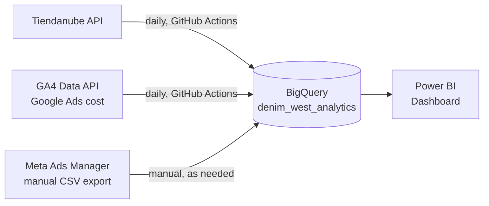
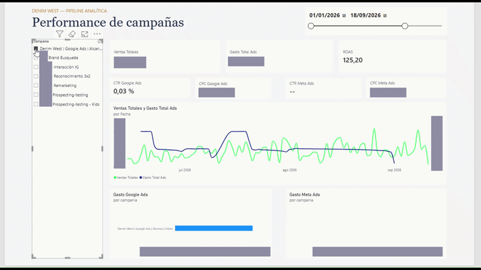

🇦🇷 [Leer en español](README.es.md)

# Denim West — Analytics Pipeline

End-to-end data pipeline that unifies sales (Tiendanube) and paid advertising (Google Ads, Meta Ads) into a BigQuery Data Warehouse, with daily automation and a Power BI dashboard to cross ad spend against real sales.

**Stack:** Python · BigQuery · GitHub Actions · Power BI · Tiendanube, Google Analytics 4, and Meta Ads Manager APIs

---

## The problem

Denim West (an apparel brand in Argentina) had its sales data and its two advertising platforms living in separate systems, never crossed with each other. There was no quick way to answer simple questions like *"which platform gives me a better return?"* or *"is ad spend actually translating into real sales?"* without opening three different panels and doing the math by hand.

## The solution

A pipeline that brings all three sources into the same Data Warehouse every day, ready to cross-reference in a dashboard.



---

## The three sources, and why each one was solved differently

### 1. Tiendanube (sales) — ✅ 100% automated

Pulls the last 90 days of orders via the API, with pagination, and loads to BigQuery every day with no manual intervention. The most interesting part isn't the script itself, but the app registration: Tiendanube offers two paths ("Custom Apps" and standard OAuth) and the first wasn't available on the store's plan — the full OAuth flow had to be worked out by hand, exchanging the authorization code for a permanent token via `curl` in PowerShell.

### 2. Google Ads — ✅ 100% automated (but not via the obvious path)

**Initial attempt:** connect directly to the Google Ads API. The full OAuth flow was built (developer token, client id/secret, refresh token) and, once the code was working, the problem appeared: the Manager account it pointed to had been **deactivated**. The real active account had a different ID.

**Actual solution:** instead of chasing a fix for that account, the fact that the GA4 property already had cost-import linked to Google Ads was leveraged instead. The GA4 Data API exposes the same metrics (cost, clicks, impressions) without any of the Manager account issues. The discarded script was kept in the repo (`scripts/google_ads_extraccion.py`) as a record of that decision.

### 3. Meta Ads — ⚠️ the only manual source, and for a real reason

Four different paths to Meta's API were tried (personal access, a new app, the existing app connected as a Business asset, reviewing app roles). All four hit the same wall: the app was in "Development Mode" and needed a formal Meta review ("Advanced Access") that could take weeks, because the ad account wasn't 100% owned by the app's owner — a structural limitation of Meta's policy, not a configuration error.

**Decision:** manual CSV upload, exported directly from Meta Ads Manager. The script (`scripts/cargar_meta_ads_csv.py`) automatically finds the most recent export in the Downloads folder, so the only real manual step is "export the CSV" — everything else stays automated.

---

## Automation

Tiendanube and Google Ads run on their own every day via **GitHub Actions** (`.github/workflows/`). Each run replaces the full table in BigQuery (`WRITE_TRUNCATE`) instead of doing an upsert — a decision driven by the project running in BigQuery's sandbox mode (no billing enabled), which doesn't support `MERGE`.

## Data verification

It's not enough for the pipeline to run — the data has to be confirmed correct. Direct SQL in BigQuery was used to:
- Compare date coverage across the three sources with a `UNION ALL` query
- Confirm the column schema of each table with `INFORMATION_SCHEMA`

One specific finding is worth calling out: a 4-day gap with no data was detected in the Google Ads table. Instead of assuming it was a bug, it was investigated with a debug script querying the GA4 API directly — the result confirmed those days had no real spend, not a pipeline error. Full detail in `docs/hallazgo-google-ads.txt`.

## Dashboard (Power BI)

Star schema model: a Calendar table and a Campaigns bridge table at the center, related against the three fact tables (never against each other, to avoid duplicating rows from different granularities).

Three pages — screenshots in `dashboard/`:

| Page | Content |
|---|---|
| Campaign Performance | General KPIs, ROAS, spend and efficiency (CTR/CPC) comparison between Google Ads and Meta Ads, sales vs. spend trend over time |
| Product & Order Analysis | Average ticket, payment status, sales by shipping method and by day of week, top SKUs |
| Time Comparisons | ROAS over time, monthly sales and spend |



**Business result:** the model confirms a ROAS of **7.52x** over the analyzed period (90 days) — for every peso spent on advertising, the return in sales was more than 7 times that spend. Absolute revenue and spend figures are kept out of this repository per agreement with the brand; the code and full methodology are 100% real and verifiable.

## Running it locally

```bash
pip install -r requirements.txt
```

Each script expects its credentials as environment variables (see the `os.getenv(...)` calls in each file) — none are hardcoded. A Google Cloud credentials file (`gcp-credentials.json`, not included in this repo) with permissions on BigQuery and the GA4 property is also required.

---

## About this project

Built end-to-end — from registering the app on Tiendanube to the final dashboard — as a data analyst / performance analyst, applying the same approach I use in my day-to-day work. The discarded paths (the old Google Ads script, the 4 failed attempts with the Meta API) were deliberately kept documented: they reflect the real process of solving problems with data, not just the final result.

**Jesús González** — [LinkedIn](#) · [Portfolio](#)
