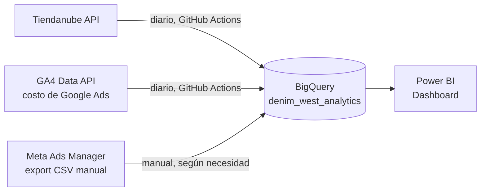

🇺🇸 [Read in English](README.md)

# Pipeline de Analítica — Denim West

Pipeline de datos end-to-end que unifica ventas (Tiendanube) y publicidad paga (Google Ads, Meta Ads) en un Data Warehouse en BigQuery, con automatización diaria y un dashboard en Power BI para cruzar gasto publicitario contra ventas reales.

**Stack:** Python · BigQuery · GitHub Actions · Power BI · APIs de Tiendanube, Google Analytics 4 y Meta Ads Manager

---

## El problema

Denim West (marca de indumentaria en Argentina) tenía sus datos de ventas y de las dos plataformas de publicidad viviendo en sistemas separados, sin cruzar entre sí. No había forma rápida de responder preguntas simples como *"¿qué plataforma me da mejor retorno?"* o *"¿el gasto en ads se está traduciendo en ventas reales?"* sin entrar a tres paneles distintos y calcular a mano.

## La solución

Un pipeline que trae las tres fuentes a un mismo Data Warehouse todos los días, listo para cruzar en un dashboard.



---

## Las tres fuentes, y por qué cada una se resolvió distinto

### 1. Tiendanube (ventas) —  100% automatizado

Trae los pedidos de los últimos 90 días vía API, con paginación, y carga a BigQuery todos los días sin intervención manual. La parte más interesante no es el script en sí, sino el registro de la app: Tiendanube ofrece dos caminos ("Aplicaciones a medida" y OAuth estándar) y el primero no estaba disponible en el plan de la tienda — hubo que resolver el flujo OAuth completo a mano, intercambiando el código de autorización por un token permanente vía `curl` en PowerShell.

### 2. Google Ads —  100% automatizado (pero no por el camino obvio)

**Intento inicial:** conectar directo a la API de Google Ads. Se armó todo el flujo de OAuth (developer token, client id/secret, refresh token) y, ya con el código funcionando, apareció el problema: la cuenta Manager a la que apuntaba estaba **dada de baja**. La cuenta activa real tenía un ID distinto.

**Solución real:** en vez de perseguir el arreglo de esa cuenta, se aprovechó que la property de GA4 ya tenía el vínculo de importación de costos con Google Ads activado. La API de datos de GA4 expone las mismas métricas (costo, clics, impresiones) sin pasar por ninguno de los problemas de la cuenta Manager. El script descartado se conservó en el repo (`scripts/google_ads_extraccion.py`) como registro de esa decisión.

### 3. Meta Ads —  la única fuente manual, y por una razón real

Se probaron 4 vías distintas de acceso a la API de Meta (acceso personal, una app nueva, la app existente conectada como activo del Business, revisión de roles). Las cuatro chocaron con el mismo bloqueo: la app estaba en "Modo Desarrollo" y necesitaba una revisión formal de Meta ("Acceso avanzado") que podía tardar semanas, porque la cuenta publicitaria no era 100% propiedad del dueño de la app — una limitación estructural de la política de Meta, no un error de configuración.

**Decisión:** carga manual por CSV, exportado directamente desde Meta Ads Manager. El script (`scripts/cargar_meta_ads_csv.py`) busca automáticamente el export más reciente en la carpeta de Descargas, para que el único paso manual real sea "exportar el CSV" — todo lo demás sigue automatizado.

---

## Automatización

Tiendanube y Google Ads corren solos todos los días vía **GitHub Actions** (`.github/workflows/`). Cada corrida reemplaza la tabla completa en BigQuery (`WRITE_TRUNCATE`) en vez de hacer upsert, una decisión tomada porque el proyecto corre en modo sandbox de BigQuery (sin facturación habilitada), que no soporta `MERGE`.

## Verificación de datos

No alcanza con que el pipeline corra — hay que confirmar que los datos son correctos. Se usó SQL directo en BigQuery para:
- Comparar la cobertura de fechas de las tres fuentes con un query `UNION ALL`
- Confirmar el esquema de columnas de cada tabla con `INFORMATION_SCHEMA`

Un hallazgo puntual vale la pena mencionar: se detectó un hueco de 4 días sin datos en la tabla de Google Ads. En vez de asumir que era un bug, se investigó con un script de debug contra la API de GA4 directamente — el resultado confirmó que esos días no tuvieron gasto real, no era un error del pipeline. El detalle completo está en `docs/hallazgo-google-ads.txt`.

## Dashboard (Power BI)

Modelo en star schema: una tabla de Calendario y una tabla puente de Campañas en el centro, relacionadas contra las tres tablas de hechos (nunca entre sí, para evitar duplicar filas por distinta granularidad).

Tres páginas — capturas en `dashboard/`:

| Página | Contenido |
|---|---|
| Performance de campañas | KPIs generales, ROAS, comparación de gasto y eficiencia (CTR/CPC) entre Google Ads y Meta Ads, tendencia de ventas vs. gasto en el tiempo |
| Análisis de producto y pedidos | Ticket promedio, estados de pago, ventas por método de envío y por día de la semana, top SKUs |
| Comparativas temporales | ROAS en el tiempo, ventas y gasto agregados por mes |


**Resultado de negocio:** el modelo confirma un ROAS de **7,52x** en el período analizado (90 días) — por cada peso invertido en publicidad, el retorno en ventas fue más de 7 veces esa inversión. Los montos absolutos de facturación y gasto se mantienen fuera de este repositorio por acuerdo con la marca; el código y la metodología completa sí son 100% reales y verificables.

## Cómo correrlo

```bash
pip install -r requirements.txt
```

Cada script espera sus credenciales como variables de entorno (ver los `os.getenv(...)` en cada archivo) — nunca están escritas en el código. Hace falta además un archivo de credenciales de Google Cloud (`gcp-credentials.json`, no incluido en este repo) con permisos sobre BigQuery y sobre la property de GA4.

---

## Sobre este proyecto

Construido de punta a punta —desde el registro de la app en Tiendanube hasta el dashboard final— como analista de datos / performance, aplicando el mismo criterio que uso en mi trabajo diario. Los caminos descartados (el script viejo de Google Ads, los 4 intentos fallidos con la API de Meta) se dejaron documentados a propósito: reflejan el proceso real de resolver problemas con datos, no solo el resultado final.

**Jesús González** — [LinkedIn](#) · [Portfolio](#)
